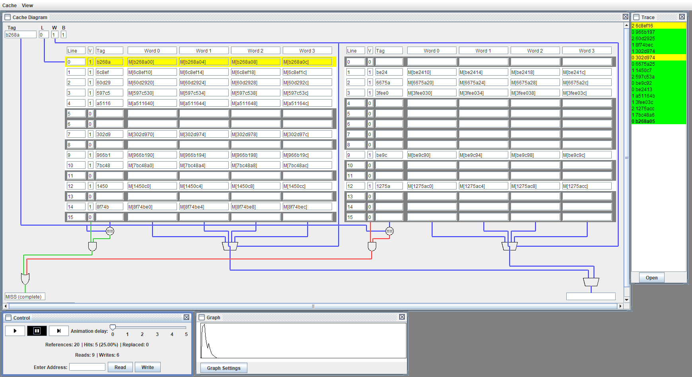

# Cache Visualization

This app visualizes cache interaction on various caches of different sizes, structures, and policies. VCache simulates directed mapped caches, partially and fully associative caches of different sizes in line count and word per line count with different write policies and replacement policies. A processor cache is a volatile memory structure that is smaller and faster than the main memory (RAM) through which the processor does its memory operations.

# To Use the App

This app allows users to both simulate reading and writing address by address and read from a txt config file and see the entire process using the “VCR” controls to start, pause, single-step, or stop the animation.  Memory references use the same format as the Dinero IV Cache Simulator.

To change the properties of the cache click the Cache top item menu.

# References

Jan Edler and Mark D. Hill, [Dinero IV](http://pages.cs.wisc.edu/~markhill/DineroIV/)
